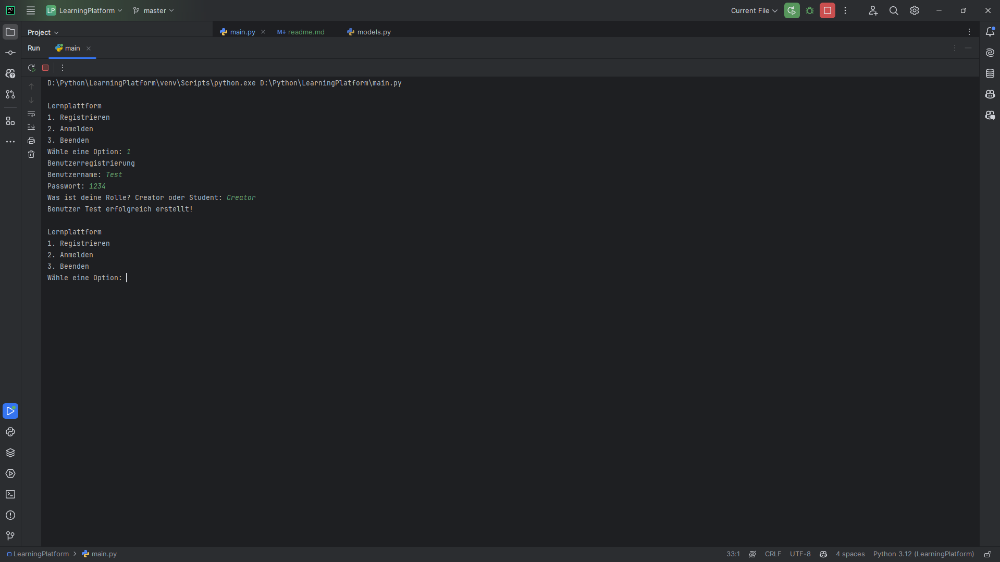
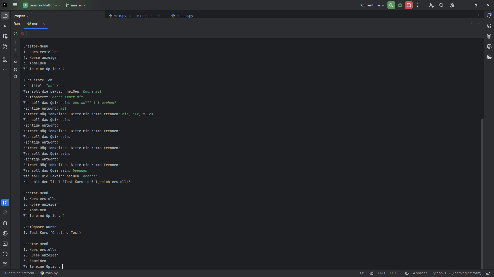
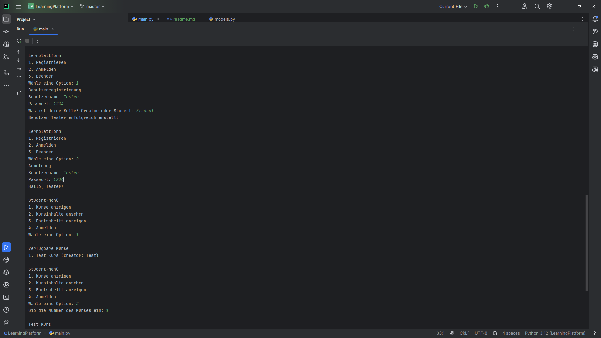
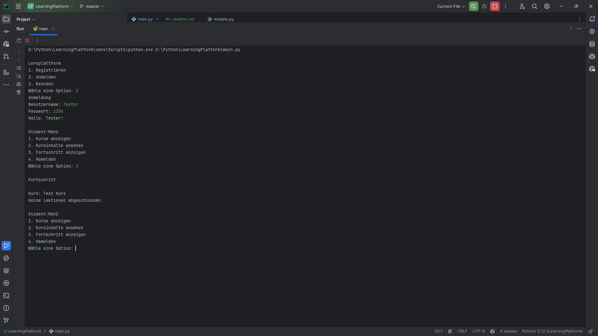

# Learning Platform
## Description
This is a Tool to create Learning Content and Multiquoice Quizzes for an cours or somehin like that.

## Installation/Usage
1. Clone the repository
2. Run `pip install -r requirements.txt`
3. Run `python main.py`
4. Create a Account as Creator and follow the instructions on the Creator Menu
5. Share the database.json data file with all Computers that run a Client
6. Make usefull content
7. Have fun with learning

## Preview
  
  
  
  